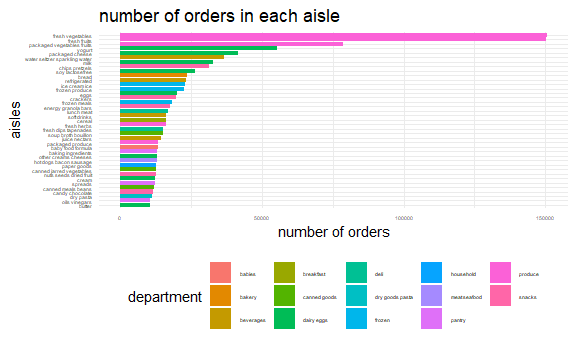
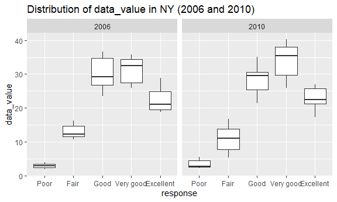

hw3\_yt2785
================

``` r
library(tidyverse)
library(ggridges)
library(tidyverse)
library(patchwork)
library(viridis)

knitr::opts_chunk$set(
  fig.width = 6,
  fig.asp = .6
,
out.width = "90%"
)
```

**Problem 1**

\#\#load the `instacart` data and tidy the name.

``` r
library(p8105.datasets) 
data("instacart")
instacart_df = 
  instacart %>% 
  janitor::clean_names()

n_row_instacart = nrow(instacart_df)
n_col_instacart = ncol(instacart_df)
name_instacart = colnames(instacart_df)

instacart_df %>% 
  distinct(department) %>%
    summarize(n_department = n())
```

    ## # A tibble: 1 x 1
    ##   n_department
    ##          <int>
    ## 1           21

``` r
instacart_df %>%
  distinct(aisle) %>% 
  summarize(n_aisle = n())
```

    ## # A tibble: 1 x 1
    ##   n_aisle
    ##     <int>
    ## 1     134

**Destribution: This data set includes 1384617 observations and 15
variables. The name of the variables are order\_id, product\_id,
add\_to\_cart\_order, reordered, user\_id, eval\_set, order\_number,
order\_dow, order\_hour\_of\_day, days\_since\_prior\_order,
product\_name, aisle\_id, department\_id, aisle, department. There are
21 kinds of department and 134 kinds of aisle in total. Only these 2
variables are characters in this data set.**

\#\#How many aisles are there, and which aisles are the most items
ordered from?

``` r
aisle_df = 
  instacart_df %>%
  group_by(aisle) %>% 
  summarize(n_obs = n())
n_row_aisle = nrow(aisle_df)


aisle_most_df = 
  aisle_df %>% 
  mutate(aisle_rank = min_rank(desc(n_obs))) %>% 
  filter(aisle_rank == 1) 
knitr::kable(aisle_most_df)
```

| aisle            | n\_obs | aisle\_rank |
|:-----------------|-------:|------------:|
| fresh vegetables | 150609 |           1 |

**There are 134 aisles in the data frame.The `fresh vegetables` aisles
are the most items ordered from.**

\#\#Make a plot that shows the number of items ordered in each aisle,
limiting this to aisles with more than 10000 items ordered.

``` r
instacart_df %>%
  group_by(aisle, department) %>% 
  summarize(n_obs = n()) %>% 
  filter(n_obs > 10000) %>% 
 ggplot(aes(x = reorder(aisle,n_obs), y = n_obs, fill = department)) +
  geom_col() +
  labs(
    title = "number of orders in each aisle",
    x = "aisles",
    y = "number of orders"
  ) + 
  theme_minimal() +
  theme(axis.text.y = element_text(hjust = 1), 
        axis.text = element_text(),
        legend.position = "bottom",
        legend.text = element_text()) + 
  coord_flip()
```

    ## `summarise()` has grouped output by 'aisle'. You can override using the `.groups` argument.



\#\#Make a table showing the three most popular items in each of the
aisles `baking ingredients`, `dog food care`, and
`packaged vegetables fruits`.

``` r
most_popular_item = 
  instacart_df %>% 
  filter(aisle %in% c("baking ingredients","dog food care","packaged vegetables fruits")) %>% 
  group_by(aisle,product_name) %>% 
  summarize(n_times = n()) %>% 
  mutate(product_rank = min_rank(desc(n_times))) %>% 
  filter(product_rank == 1) %>% 
  select(-product_rank)
```

    ## `summarise()` has grouped output by 'aisle'. You can override using the `.groups` argument.

``` r
  knitr::kable(most_popular_item)
```

| aisle                      | product\_name                                 | n\_times |
|:---------------------------|:----------------------------------------------|---------:|
| baking ingredients         | Light Brown Sugar                             |      499 |
| dog food care              | Snack Sticks Chicken & Rice Recipe Dog Treats |       30 |
| packaged vegetables fruits | Organic Baby Spinach                          |     9784 |

\#\#Make a table showing the mean hour of the day at which Pink Lady
Apples and Coffee Ice Cream are ordered on each day of the week.

``` r
mean_hour_df = 
  instacart_df %>%
  filter(product_name %in% c("Pink Lady Apples","Coffee Ice Cream")) %>% 
  group_by(product_name,order_dow) %>% 
  summarize(mean_hour = mean(order_hour_of_day, na.rm = TRUE)) %>%
  mutate(order_dow = recode(order_dow, '0' = "Sunday",'1' = "Monday", '2' = "Tuesday", '3' = "Wednesday", '4' = "Thursday", '5' = "Friday", '6' = "Saturday")) %>% 
   pivot_wider(
    names_from = "order_dow",
    values_from = "mean_hour"
  ) 
```

    ## `summarise()` has grouped output by 'product_name'. You can override using the `.groups` argument.

``` r
knitr::kable(mean_hour_df)
```

| product\_name    |   Sunday |   Monday |  Tuesday | Wednesday | Thursday |   Friday | Saturday |
|:-----------------|---------:|---------:|---------:|----------:|---------:|---------:|---------:|
| Coffee Ice Cream | 13.77419 | 14.31579 | 15.38095 |  15.31818 | 15.21739 | 12.26316 | 13.83333 |
| Pink Lady Apples | 13.44118 | 11.36000 | 11.70213 |  14.25000 | 11.55172 | 12.78431 | 11.93750 |

**Problem 2**

\#\#load the brfss data and clean it

``` r
data("brfss_smart2010")

brfss = 
  brfss_smart2010 %>%
  janitor::clean_names() %>% 
    rename(state = locationabbr) %>% 
  filter(topic %in% c("Overall Health")) %>% 
  filter(response %in% c("Excellent","Very good","Fair","Good","Poor")) %>% 
  mutate(
    response_rank = recode(response, `Poor` = "1", `Fair` = "2", `Good` = "3", `Very good` = "4", `Excellent` = "5"),
    response = fct_reorder(response, response_rank))

brfss
```

    ## # A tibble: 10,625 x 24
    ##     year state locationdesc class topic question response sample_size data_value
    ##    <int> <chr> <chr>        <chr> <chr> <chr>    <fct>          <int>      <dbl>
    ##  1  2010 AL    AL - Jeffer~ Heal~ Over~ How is ~ Excelle~          94       18.9
    ##  2  2010 AL    AL - Jeffer~ Heal~ Over~ How is ~ Very go~         148       30  
    ##  3  2010 AL    AL - Jeffer~ Heal~ Over~ How is ~ Good             208       33.1
    ##  4  2010 AL    AL - Jeffer~ Heal~ Over~ How is ~ Fair             107       12.5
    ##  5  2010 AL    AL - Jeffer~ Heal~ Over~ How is ~ Poor              45        5.5
    ##  6  2010 AL    AL - Mobile~ Heal~ Over~ How is ~ Excelle~          91       15.6
    ##  7  2010 AL    AL - Mobile~ Heal~ Over~ How is ~ Very go~         177       31.3
    ##  8  2010 AL    AL - Mobile~ Heal~ Over~ How is ~ Good             224       31.2
    ##  9  2010 AL    AL - Mobile~ Heal~ Over~ How is ~ Fair             120       15.5
    ## 10  2010 AL    AL - Mobile~ Heal~ Over~ How is ~ Poor              66        6.4
    ## # ... with 10,615 more rows, and 15 more variables: confidence_limit_low <dbl>,
    ## #   confidence_limit_high <dbl>, display_order <int>, data_value_unit <chr>,
    ## #   data_value_type <chr>, data_value_footnote_symbol <chr>,
    ## #   data_value_footnote <chr>, data_source <chr>, class_id <chr>,
    ## #   topic_id <chr>, location_id <chr>, question_id <chr>, respid <chr>,
    ## #   geo_location <chr>, response_rank <chr>

\#\#In 2002, which states were observed at 7 or more locations? What
about in 2010?

``` r
brfss_2002 = 
  brfss %>% 
  filter(year == 2002) %>% 
  group_by(state) %>% 
  distinct(locationdesc) %>% 
  summarize(n_state_2002 = n()) %>% 
  filter(n_state_2002 > 6)

brfss_2010 = 
  brfss %>% 
  filter(year == 2010) %>% 
  group_by(state) %>% 
  distinct(locationdesc) %>% 
  summarize(n_state_2010 = n()) %>% 
  filter(n_state_2010 > 6) 

brfss_2002
```

    ## # A tibble: 6 x 2
    ##   state n_state_2002
    ##   <chr>        <int>
    ## 1 CT               7
    ## 2 FL               7
    ## 3 MA               8
    ## 4 NC               7
    ## 5 NJ               8
    ## 6 PA              10

``` r
brfss_2010
```

    ## # A tibble: 14 x 2
    ##    state n_state_2010
    ##    <chr>        <int>
    ##  1 CA              12
    ##  2 CO               7
    ##  3 FL              41
    ##  4 MA               9
    ##  5 MD              12
    ##  6 NC              12
    ##  7 NE              10
    ##  8 NJ              19
    ##  9 NY               9
    ## 10 OH               8
    ## 11 PA               7
    ## 12 SC               7
    ## 13 TX              16
    ## 14 WA              10

``` r
name_2002 = pull(brfss_2002, state)
name_2010 = pull(brfss_2010, state)
```

**The states that were observed at 7 or more locations in 2002 are CT,
FL, MA, NC, NJ, PA. The states that were observed at 7 or more locations
in 2010 are CA, CO, FL, MA, MD, NC, NE, NJ, NY, OH, PA, SC, TX, WA.**

\#\#Construct a dataset that is limited to Excellent responses, and
contains, year, state, and a variable that averages the data\_value
across locations within a state.

``` r
excellent_df = 
  brfss %>% 
  filter(response == "Excellent") %>% 
  group_by(state, year) %>% 
  summarize(mean_data_value = mean(data_value, na.rm = TRUE)) 
```

    ## `summarise()` has grouped output by 'state'. You can override using the `.groups` argument.

``` r
excellent_df
```

    ## # A tibble: 443 x 3
    ## # Groups:   state [51]
    ##    state  year mean_data_value
    ##    <chr> <int>           <dbl>
    ##  1 AK     2002            27.9
    ##  2 AK     2003            24.8
    ##  3 AK     2004            23.0
    ##  4 AK     2005            23.8
    ##  5 AK     2007            23.5
    ##  6 AK     2008            20.6
    ##  7 AK     2009            23.2
    ##  8 AL     2002            18.5
    ##  9 AL     2003            19.5
    ## 10 AL     2004            20  
    ## # ... with 433 more rows

\#\#Make a `spaghetti` plot of this average value over time within a
state

``` r
ggplot(data = excellent_df, aes(x = year, y = mean_data_value, color = state)) +
  geom_line(aes(group = state))
```


\#\#Make a two-panel plot showing, for the years 2006, and 2010,
distribution of data\_value for responses (`Poor` to `Excellent`) among
locations in NY State.

``` r
brfss %>% 
  group_by(year, state) %>% 
  filter((year == 2006 | year == 2010),
         state == "NY") %>% 
  ggplot(aes(x = response, y = data_value)) +
  geom_boxplot() +
  labs(title = "Distribution of data_value in NY (2006 and 2010)") +
  facet_grid(. ~ year)
```



**Problem 3**

\#\#Load, tidy, and otherwise wrangle the data.

``` r
accel_df = 
  read_csv("./accel_data.csv") %>% 
  janitor::clean_names() %>% 
  mutate(weekday_vs_weekend = recode(day, 'Monday' = "weekday",'Tuesday' = "weekday", 'Wednesday' = "weekday", 'Thursday' = "weekday", 'Friday' = "weekday", 'Saturday' = "weekend", 'Sunday' = "weekend")) %>% 
  select(week, day_id, day, weekday_vs_weekend, everything()) %>% 
  pivot_longer(
    activity_1 : activity_1440,
    names_to = "time_minute",
    names_prefix = "activity_",
    values_to = "activity_count"
  ) %>% 
  mutate(time_minute = as.numeric(time_minute))
```

    ## Rows: 35 Columns: 1443

    ## -- Column specification --------------------------------------------------------
    ## Delimiter: ","
    ## chr    (1): day
    ## dbl (1442): week, day_id, activity.1, activity.2, activity.3, activity.4, ac...

    ## 
    ## i Use `spec()` to retrieve the full column specification for this data.
    ## i Specify the column types or set `show_col_types = FALSE` to quiet this message.

``` r
name_accel = colnames(accel_df)
n_col_accel = ncol(accel_df)
```

**There are 6 observations and week, day\_id, day, weekday\_vs\_weekend,
time\_minute, activity\_count variables exist. All of the minute and
their activity count is linked together clearly.**

\#\#aggregate accross minutes to create a total activity variable for
each day, and create a table showing these totals.

``` r
select_activity_df = 
accel_df %>% 
  group_by(day_id, week, day) %>% 
  summarize(total = sum(activity_count)) 
```

    ## `summarise()` has grouped output by 'day_id', 'week'. You can override using the `.groups` argument.

``` r
knitr::kable(select_activity_df)
```

| day\_id | week | day       |     total |
|--------:|-----:|:----------|----------:|
|       1 |    1 | Friday    | 480542.62 |
|       2 |    1 | Monday    |  78828.07 |
|       3 |    1 | Saturday  | 376254.00 |
|       4 |    1 | Sunday    | 631105.00 |
|       5 |    1 | Thursday  | 355923.64 |
|       6 |    1 | Tuesday   | 307094.24 |
|       7 |    1 | Wednesday | 340115.01 |
|       8 |    2 | Friday    | 568839.00 |
|       9 |    2 | Monday    | 295431.00 |
|      10 |    2 | Saturday  | 607175.00 |
|      11 |    2 | Sunday    | 422018.00 |
|      12 |    2 | Thursday  | 474048.00 |
|      13 |    2 | Tuesday   | 423245.00 |
|      14 |    2 | Wednesday | 440962.00 |
|      15 |    3 | Friday    | 467420.00 |
|      16 |    3 | Monday    | 685910.00 |
|      17 |    3 | Saturday  | 382928.00 |
|      18 |    3 | Sunday    | 467052.00 |
|      19 |    3 | Thursday  | 371230.00 |
|      20 |    3 | Tuesday   | 381507.00 |
|      21 |    3 | Wednesday | 468869.00 |
|      22 |    4 | Friday    | 154049.00 |
|      23 |    4 | Monday    | 409450.00 |
|      24 |    4 | Saturday  |   1440.00 |
|      25 |    4 | Sunday    | 260617.00 |
|      26 |    4 | Thursday  | 340291.00 |
|      27 |    4 | Tuesday   | 319568.00 |
|      28 |    4 | Wednesday | 434460.00 |
|      29 |    5 | Friday    | 620860.00 |
|      30 |    5 | Monday    | 389080.00 |
|      31 |    5 | Saturday  |   1440.00 |
|      32 |    5 | Sunday    | 138421.00 |
|      33 |    5 | Thursday  | 549658.00 |
|      34 |    5 | Tuesday   | 367824.00 |
|      35 |    5 | Wednesday | 445366.00 |

**It seems that in the same week, the total activity count increase from
Monday to Sunday.But in the 4th and 5th week, the total activity count
is abnormally low on Saturday.**

## Make a single-panel plot that shows the 24-hour activity time courses for each day and use color to indicate day of the week.

``` r
accel_df %>% 
  ggplot(aes(x = time_minute, y = activity_count, color = day)) + 
  geom_line() +
  labs(
    title = "24h activity",
    x = "Time",
    y = "Activity Count"
  ) +
  scale_x_continuous(breaks = c(0, 120, 240 ,360, 480, 600, 720, 840, 960,1080, 1200, 1320, 1440), 
                   labels = c("12am","2am", "4am", "6am", "8am", "10am", "12pm", "2pm", "4pm", "6pm", "8pm", "10pm", "12am"),
                   limits = c(0, 1440))
```


**The highest activity count always appear at 8pm everyday, and it’s
always the lowest at 12am everyday. The height of activity always
increase gradually from 12am to 12pm, and always decrease gradually from
10pm to 12am. 12pm is also a small peak of activity count. These mean
that the man will take relax from 10pm to 8am in the next day, and will
have the most active time at 8pm everyday.**
