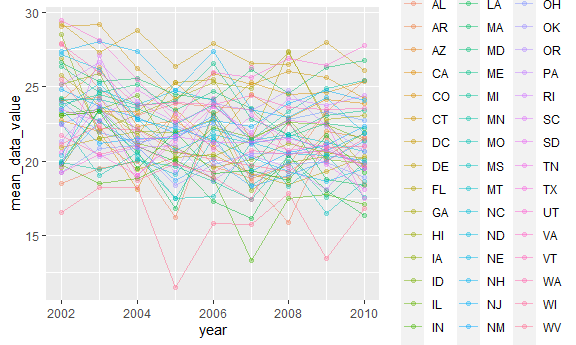

hw3\_yt2785
================

``` r
library(tidyverse)
```

    ## -- Attaching packages --------------------------------------- tidyverse 1.3.1 --

    ## v ggplot2 3.3.5     v purrr   0.3.4
    ## v tibble  3.1.4     v dplyr   1.0.7
    ## v tidyr   1.1.3     v stringr 1.4.0
    ## v readr   2.0.1     v forcats 0.5.1

    ## -- Conflicts ------------------------------------------ tidyverse_conflicts() --
    ## x dplyr::filter() masks stats::filter()
    ## x dplyr::lag()    masks stats::lag()

``` r
library(ggridges)
library(tidyverse)
library(patchwork)
library(viridis)
```

    ## 载入需要的程辑包：viridisLite

``` r
knitr::opts_chunk$set(
  fig.width = 6,
  fig.asp = .6
,
out.width = "90%"
)
```

**Problem 1** This problem uses the Instacart data. DO NOT include this
dataset in your local data directory; instead, load the data from the
p8105.datasets using:

``` r
library(p8105.datasets) 
data("instacart")
instacart %>% 
  janitor::clean_names()
```

    ## Warning in FUN(X[[i]], ...): strings not representable in native encoding will
    ## be translated to UTF-8

    ## Warning in FUN(X[[i]], ...): unable to translate '<U+00C4>' to native encoding

    ## Warning in FUN(X[[i]], ...): unable to translate '<U+00D6>' to native encoding

    ## Warning in FUN(X[[i]], ...): unable to translate '<U+00E4>' to native encoding

    ## Warning in FUN(X[[i]], ...): unable to translate '<U+00F6>' to native encoding

    ## Warning in FUN(X[[i]], ...): unable to translate '<U+00DF>' to native encoding

    ## Warning in FUN(X[[i]], ...): unable to translate '<U+00C6>' to native encoding

    ## Warning in FUN(X[[i]], ...): unable to translate '<U+00E6>' to native encoding

    ## Warning in FUN(X[[i]], ...): unable to translate '<U+00D8>' to native encoding

    ## Warning in FUN(X[[i]], ...): unable to translate '<U+00F8>' to native encoding

    ## Warning in FUN(X[[i]], ...): unable to translate '<U+00C5>' to native encoding

    ## Warning in FUN(X[[i]], ...): unable to translate '<U+00E5>' to native encoding

    ## # A tibble: 1,384,617 x 15
    ##    order_id product_id add_to_cart_order reordered user_id eval_set order_number
    ##       <int>      <int>             <int>     <int>   <int> <chr>           <int>
    ##  1        1      49302                 1         1  112108 train               4
    ##  2        1      11109                 2         1  112108 train               4
    ##  3        1      10246                 3         0  112108 train               4
    ##  4        1      49683                 4         0  112108 train               4
    ##  5        1      43633                 5         1  112108 train               4
    ##  6        1      13176                 6         0  112108 train               4
    ##  7        1      47209                 7         0  112108 train               4
    ##  8        1      22035                 8         1  112108 train               4
    ##  9       36      39612                 1         0   79431 train              23
    ## 10       36      19660                 2         1   79431 train              23
    ## # ... with 1,384,607 more rows, and 8 more variables: order_dow <int>,
    ## #   order_hour_of_day <int>, days_since_prior_order <int>, product_name <chr>,
    ## #   aisle_id <int>, department_id <int>, aisle <chr>, department <chr>

\#\#How many aisles are there, and which aisles are the most items
ordered from?

``` r
aisle_df = 
  instacart %>%
  group_by(aisle) %>% 
  summarize(n_obs = n())
n_row_aisle = nrow(aisle_df)


aisle_most_df = 
  aisle_df %>% 
  mutate(aisle_rank = min_rank(desc(n_obs))) %>% 
  filter(aisle_rank == 1) 
knitr::kable(aisle_most_df)
```

| aisle            | n\_obs | aisle\_rank |
|:-----------------|-------:|------------:|
| fresh vegetables | 150609 |           1 |

There are 134 aisles in the data frame.The `fresh vegetables` aisles are
the most items ordered from.

\#\#Make a plot that shows the number of items ordered in each aisle,
limiting this to aisles with more than 10000 items ordered. Arrange
aisles sensibly, and organize your plot so others can read it.

``` r
instacart %>%
  group_by(aisle, department) %>% 
  summarize(n_obs = n()) %>% 
  filter(n_obs > 10000) %>% 
 ggplot(aes(x = reorder(aisle,n_obs), y = n_obs, fill = department)) +
  geom_col() +
  labs(
    title = "number of orders in each aisle",
    x = "aisles",
    y = "number of orders"
  ) + 
  theme_minimal() +
  theme(axis.text.y = element_text(hjust = 1), 
        axis.text = element_text(size = 6),
        legend.position = "bottom",
        legend.text = element_text(size = 6)) + 
  coord_flip()
```

    ## `summarise()` has grouped output by 'aisle'. You can override using the `.groups` argument.


\#\#Make a table showing the three most popular items in each of the
aisles `baking ingredients`, `dog food care`, and
`packaged vegetables fruits`. Include the number of times each item is
ordered in your table.

``` r
most_popular_item = 
  instacart %>% 
  filter(aisle %in% c("baking ingredients","dog food care","packaged vegetables fruits")) %>% 
  group_by(aisle,product_name) %>% 
  summarize(n_times = n()) %>% 
  mutate(product_rank = min_rank(desc(n_times))) %>% 
  filter(product_rank == 1) %>% 
  select(-product_rank)
```

    ## `summarise()` has grouped output by 'aisle'. You can override using the `.groups` argument.

``` r
  knitr::kable(most_popular_item)
```

| aisle                      | product\_name                                 | n\_times |
|:---------------------------|:----------------------------------------------|---------:|
| baking ingredients         | Light Brown Sugar                             |      499 |
| dog food care              | Snack Sticks Chicken & Rice Recipe Dog Treats |       30 |
| packaged vegetables fruits | Organic Baby Spinach                          |     9784 |

\#\#Make a table showing the mean hour of the day at which Pink Lady
Apples and Coffee Ice Cream are ordered on each day of the week; format
this table for human readers (i.e. produce a 2 x 7 table).

``` r
mean_hour_df = 
  instacart %>%
  filter(product_name %in% c("Pink Lady Apples","Coffee Ice Cream")) %>% 
  group_by(product_name,order_dow) %>% 
  summarize(mean_hour = mean(order_hour_of_day, na.rm = TRUE)) %>%
  mutate(order_dow = recode(order_dow, '0' = "Sunday",'1' = "Monday", '2' = "Tuesday", '3' = "Wednesday", '4' = "Thursday", '5' = "Friday", '6' = "Saturday")) %>% 
   pivot_wider(
    names_from = "order_dow",
    values_from = "mean_hour"
  ) 
```

    ## `summarise()` has grouped output by 'product_name'. You can override using the `.groups` argument.

``` r
knitr::kable(mean_hour_df)
```

| product\_name    |   Sunday |   Monday |  Tuesday | Wednesday | Thursday |   Friday | Saturday |
|:-----------------|---------:|---------:|---------:|----------:|---------:|---------:|---------:|
| Coffee Ice Cream | 13.77419 | 14.31579 | 15.38095 |  15.31818 | 15.21739 | 12.26316 | 13.83333 |
| Pink Lady Apples | 13.44118 | 11.36000 | 11.70213 |  14.25000 | 11.55172 | 12.78431 | 11.93750 |

**Problem 2** This problem uses the BRFSS data. DO NOT include this
dataset in your local data directory; instead, load the data from the
p8105.datasets package.

``` r
data("brfss_smart2010")
```

First, do some data cleaning:

format the data to use appropriate variable names; focus on the
`Overall Health` topic include only responses from `Excellent` to `Poor`
organize responses as a factor taking levels ordered from `Poor` to
`Excellent`

``` r
brfss = 
  brfss_smart2010 %>%
  janitor::clean_names() %>% 
  filter(topic %in% c("Overall Health")) %>% 
  filter(response %in% c("Excellent","Very good","Fair","Good","Poor")) %>% 
    mutate(response = recode(response, 'Excellent' = "5",'Very good' = "4", 'Good' = "3", 'Fair' = "2", 'Poor' = "1")) %>% 
  arrange(response) %>% 
  mutate(response = recode(response, '5' = "Excellent",'4' = "Very good", '3' = "Good", '2' = "Fair", '1' = "Poor")) 
```

Using this dataset, do or answer the following (commenting on the
results of each):

\#In 2002, which states were observed at 7 or more locations? What about
in 2010?

``` r
brfss_2002 = 
  brfss %>% 
  filter(year == 2002) %>% 
  group_by(locationabbr) %>% 
  summarize(n_state_2002 = n()) %>% 
  filter(n_state_2002 > 6)

brfss_2010 = 
  brfss %>% 
  filter(year == 2010) %>% 
  group_by(locationabbr) %>% 
  summarize(n_state_2010 = n()) %>% 
  filter(n_state_2010 > 6) 

knitr::kable(brfss_2002)
```

| locationabbr | n\_state\_2002 |
|:-------------|---------------:|
| AZ           |             10 |
| CO           |             20 |
| CT           |             35 |
| DE           |             15 |
| FL           |             35 |
| GA           |             15 |
| HI           |             20 |
| ID           |             10 |
| IL           |             15 |
| IN           |             10 |
| KS           |             15 |
| LA           |             15 |
| MA           |             40 |
| MD           |             30 |
| ME           |             10 |
| MI           |             20 |
| MN           |             20 |
| MO           |             10 |
| NC           |             35 |
| NE           |             15 |
| NH           |             25 |
| NJ           |             40 |
| NV           |             10 |
| NY           |             25 |
| OH           |             20 |
| OK           |             15 |
| OR           |             15 |
| PA           |             50 |
| RI           |             20 |
| SC           |             15 |
| SD           |             10 |
| TN           |             10 |
| TX           |             10 |
| UT           |             25 |
| VT           |             15 |
| WA           |             20 |

``` r
knitr::kable(brfss_2010)
```

| locationabbr | n\_state\_2010 |
|:-------------|---------------:|
| AL           |             15 |
| AR           |             15 |
| AZ           |             15 |
| CA           |             60 |
| CO           |             35 |
| CT           |             25 |
| DE           |             15 |
| FL           |            205 |
| GA           |             20 |
| HI           |             20 |
| IA           |             10 |
| ID           |             30 |
| IL           |             10 |
| IN           |             15 |
| KS           |             20 |
| LA           |             25 |
| MA           |             45 |
| MD           |             60 |
| ME           |             30 |
| MI           |             20 |
| MN           |             25 |
| MO           |             15 |
| MS           |             10 |
| MT           |             15 |
| NC           |             60 |
| ND           |             15 |
| NE           |             50 |
| NH           |             25 |
| NJ           |             95 |
| NM           |             30 |
| NV           |             10 |
| NY           |             45 |
| OH           |             40 |
| OK           |             15 |
| OR           |             20 |
| PA           |             35 |
| RI           |             25 |
| SC           |             35 |
| SD           |             10 |
| TN           |             25 |
| TX           |             80 |
| UT           |             30 |
| VT           |             30 |
| WA           |             50 |
| WY           |             10 |

\#Construct a dataset that is limited to Excellent responses, and
contains, year, state, and a variable that averages the data\_value
across locations within a state.

``` r
excellent_df = 
  brfss %>% 
  filter(response == "Excellent") %>% 
  group_by(locationabbr, year) %>% 
  summarize(mean_data_value = mean(data_value, na.rm = TRUE)) 
```

    ## `summarise()` has grouped output by 'locationabbr'. You can override using the `.groups` argument.

``` r
knitr::kable(excellent_df)
```

| locationabbr | year | mean\_data\_value |
|:-------------|-----:|------------------:|
| AK           | 2002 |          27.90000 |
| AK           | 2003 |          24.85000 |
| AK           | 2004 |          23.05000 |
| AK           | 2005 |          23.85000 |
| AK           | 2007 |          23.50000 |
| AK           | 2008 |          20.60000 |
| AK           | 2009 |          23.20000 |
| AL           | 2002 |          18.50000 |
| AL           | 2003 |          19.50000 |
| AL           | 2004 |          20.00000 |
| AL           | 2005 |          16.20000 |
| AL           | 2006 |          23.20000 |
| AL           | 2007 |          18.65000 |
| AL           | 2008 |          15.85000 |
| AL           | 2009 |          21.60000 |
| AL           | 2010 |          18.43333 |
| AR           | 2002 |          24.10000 |
| AR           | 2003 |          24.30000 |
| AR           | 2004 |          21.00000 |
| AR           | 2005 |          23.06667 |
| AR           | 2006 |          19.60000 |
| AR           | 2007 |          18.83333 |
| AR           | 2008 |          19.66667 |
| AR           | 2009 |          23.33333 |
| AR           | 2010 |          25.40000 |
| AZ           | 2002 |          24.10000 |
| AZ           | 2003 |          26.30000 |
| AZ           | 2004 |          22.32500 |
| AZ           | 2005 |          22.75000 |
| AZ           | 2006 |          20.92500 |
| AZ           | 2007 |          19.08000 |
| AZ           | 2008 |          18.86000 |
| AZ           | 2009 |          21.96667 |
| AZ           | 2010 |          21.60000 |
| CA           | 2002 |          22.70000 |
| CA           | 2003 |          22.00000 |
| CA           | 2004 |          18.10000 |
| CA           | 2005 |          23.50000 |
| CA           | 2006 |          21.20000 |
| CA           | 2007 |          24.46000 |
| CA           | 2008 |          22.88000 |
| CA           | 2009 |          24.12727 |
| CA           | 2010 |          23.87500 |
| CO           | 2002 |          23.07500 |
| CO           | 2003 |          23.32500 |
| CO           | 2004 |          23.36667 |
| CO           | 2005 |          25.30000 |
| CO           | 2006 |          23.10000 |
| CO           | 2007 |          25.26667 |
| CO           | 2008 |          24.48889 |
| CO           | 2009 |          24.65000 |
| CO           | 2010 |          25.38571 |
| CT           | 2002 |          29.05714 |
| CT           | 2003 |          29.18000 |
| CT           | 2004 |          26.26667 |
| CT           | 2005 |          24.20000 |
| CT           | 2006 |          25.86667 |
| CT           | 2007 |          25.13333 |
| CT           | 2008 |          26.00000 |
| CT           | 2009 |          25.64000 |
| CT           | 2010 |          24.24000 |
| DC           | 2002 |          29.30000 |
| DC           | 2003 |          27.30000 |
| DC           | 2004 |          28.80000 |
| DC           | 2005 |          26.40000 |
| DC           | 2006 |          27.90000 |
| DC           | 2007 |          26.60000 |
| DC           | 2008 |          26.50000 |
| DC           | 2009 |          28.00000 |
| DC           | 2010 |          26.10000 |
| DE           | 2002 |          20.90000 |
| DE           | 2003 |          21.53333 |
| DE           | 2004 |          19.43333 |
| DE           | 2005 |          20.26667 |
| DE           | 2006 |          20.43333 |
| DE           | 2007 |          19.06667 |
| DE           | 2008 |          18.43333 |
| DE           | 2009 |          19.26667 |
| DE           | 2010 |          20.30000 |
| FL           | 2002 |          25.74286 |
| FL           | 2004 |          21.72000 |
| FL           | 2005 |          25.26667 |
| FL           | 2006 |          25.50000 |
| FL           | 2007 |          21.39318 |
| FL           | 2008 |          27.35000 |
| FL           | 2009 |          22.57500 |
| FL           | 2010 |          19.56923 |
| GA           | 2002 |          26.93333 |
| GA           | 2003 |          22.03333 |
| GA           | 2006 |          25.30000 |
| GA           | 2007 |          24.88000 |
| GA           | 2008 |          27.33333 |
| GA           | 2009 |          22.80000 |
| GA           | 2010 |          23.10000 |
| HI           | 2002 |          19.57500 |
| HI           | 2003 |          23.50000 |
| HI           | 2005 |          20.90000 |
| HI           | 2006 |          19.55000 |
| HI           | 2007 |          20.07500 |
| HI           | 2008 |          21.17500 |
| HI           | 2009 |          20.60000 |
| HI           | 2010 |          20.17500 |
| IA           | 2002 |          28.50000 |
| IA           | 2003 |          21.50000 |
| IA           | 2004 |          22.00000 |
| IA           | 2005 |          21.90000 |
| IA           | 2006 |          22.80000 |
| IA           | 2007 |          18.00000 |
| IA           | 2008 |          19.86667 |
| IA           | 2009 |          20.33333 |
| IA           | 2010 |          21.90000 |
| ID           | 2002 |          25.15000 |
| ID           | 2003 |          25.90000 |
| ID           | 2004 |          21.20000 |
| ID           | 2005 |          20.56000 |
| ID           | 2006 |          20.33333 |
| ID           | 2007 |          21.47500 |
| ID           | 2008 |          22.80000 |
| ID           | 2009 |          20.10000 |
| ID           | 2010 |          19.80000 |
| IL           | 2002 |          23.20000 |
| IL           | 2003 |          23.46667 |
| IL           | 2004 |          24.40000 |
| IL           | 2005 |          20.16667 |
| IL           | 2006 |          22.23333 |
| IL           | 2007 |          21.60000 |
| IL           | 2008 |          22.60000 |
| IL           | 2009 |          22.45000 |
| IL           | 2010 |          21.35000 |
| IN           | 2002 |          19.75000 |
| IN           | 2003 |          18.50000 |
| IN           | 2004 |          18.85000 |
| IN           | 2005 |          20.05000 |
| IN           | 2006 |          18.85000 |
| IN           | 2007 |          13.30000 |
| IN           | 2008 |          17.45000 |
| IN           | 2009 |          17.77500 |
| IN           | 2010 |          17.10000 |
| KS           | 2002 |          23.10000 |
| KS           | 2003 |          23.33333 |
| KS           | 2004 |          19.52500 |
| KS           | 2005 |          22.00000 |
| KS           | 2006 |          19.17500 |
| KS           | 2007 |          19.35000 |
| KS           | 2008 |          18.67500 |
| KS           | 2009 |          21.68750 |
| KS           | 2010 |          19.22500 |
| KY           | 2002 |          19.80000 |
| KY           | 2003 |          23.50000 |
| KY           | 2004 |          21.00000 |
| KY           | 2005 |          20.00000 |
| KY           | 2006 |          17.30000 |
| KY           | 2007 |          16.10000 |
| KY           | 2008 |          20.40000 |
| KY           | 2009 |          18.00000 |
| KY           | 2010 |          16.30000 |
| LA           | 2002 |          24.20000 |
| LA           | 2003 |          22.67500 |
| LA           | 2004 |          20.65556 |
| LA           | 2005 |          16.80000 |
| LA           | 2006 |          23.24000 |
| LA           | 2007 |          19.60000 |
| LA           | 2008 |          22.68000 |
| LA           | 2009 |          18.78750 |
| LA           | 2010 |          18.36000 |
| MA           | 2002 |          26.61250 |
| MA           | 2003 |          25.33750 |
| MA           | 2004 |          25.58750 |
| MA           | 2005 |          24.47500 |
| MA           | 2006 |          24.11250 |
| MA           | 2007 |          26.16000 |
| MA           | 2008 |          24.57273 |
| MA           | 2009 |          26.27778 |
| MA           | 2010 |          26.78889 |
| MD           | 2002 |          26.40000 |
| MD           | 2003 |          24.65000 |
| MD           | 2004 |          25.13333 |
| MD           | 2005 |          23.39091 |
| MD           | 2006 |          24.66923 |
| MD           | 2007 |          23.52727 |
| MD           | 2008 |          21.66923 |
| MD           | 2009 |          22.50833 |
| MD           | 2010 |          22.20000 |
| ME           | 2002 |          23.80000 |
| ME           | 2003 |          24.45000 |
| ME           | 2004 |          23.75000 |
| ME           | 2005 |          24.00000 |
| ME           | 2006 |          26.55000 |
| ME           | 2007 |          22.80000 |
| ME           | 2008 |          21.82000 |
| ME           | 2009 |          23.06000 |
| ME           | 2010 |          23.38333 |
| MI           | 2002 |          19.92500 |
| MI           | 2003 |          19.40000 |
| MI           | 2004 |          20.06667 |
| MI           | 2005 |          19.61667 |
| MI           | 2006 |          18.63333 |
| MI           | 2007 |          17.42500 |
| MI           | 2008 |          20.40000 |
| MI           | 2009 |          17.52500 |
| MI           | 2010 |          19.87500 |
| MN           | 2002 |          24.15000 |
| MN           | 2003 |          24.16667 |
| MN           | 2004 |          23.52500 |
| MN           | 2005 |          22.45000 |
| MN           | 2006 |          23.83333 |
| MN           | 2007 |          21.45000 |
| MN           | 2008 |          23.32500 |
| MN           | 2009 |          24.87500 |
| MN           | 2010 |          25.44000 |
| MO           | 2002 |          22.55000 |
| MO           | 2003 |          19.05000 |
| MO           | 2004 |          20.56667 |
| MO           | 2005 |          17.46667 |
| MO           | 2006 |          17.60000 |
| MO           | 2007 |          21.23333 |
| MO           | 2008 |          18.26667 |
| MO           | 2009 |          20.43333 |
| MO           | 2010 |          17.53333 |
| MS           | 2002 |          20.00000 |
| MS           | 2003 |          23.40000 |
| MS           | 2004 |          20.30000 |
| MS           | 2005 |          17.50000 |
| MS           | 2006 |          21.56667 |
| MS           | 2007 |          18.37500 |
| MS           | 2008 |          20.00000 |
| MS           | 2009 |          16.46250 |
| MS           | 2010 |          18.65000 |
| MT           | 2004 |          20.10000 |
| MT           | 2005 |          19.10000 |
| MT           | 2006 |          22.15000 |
| MT           | 2007 |          21.40000 |
| MT           | 2008 |          21.80000 |
| MT           | 2009 |          21.27500 |
| MT           | 2010 |          20.63333 |
| NC           | 2002 |          23.55714 |
| NC           | 2003 |          25.24000 |
| NC           | 2004 |          22.77333 |
| NC           | 2005 |          20.71333 |
| NC           | 2006 |          21.82000 |
| NC           | 2007 |          21.16667 |
| NC           | 2008 |          21.65625 |
| NC           | 2009 |          20.68667 |
| NC           | 2010 |          21.88333 |
| ND           | 2002 |          20.40000 |
| ND           | 2003 |          24.80000 |
| ND           | 2004 |          23.80000 |
| ND           | 2005 |          24.75000 |
| ND           | 2006 |          24.10000 |
| ND           | 2007 |          21.25000 |
| ND           | 2008 |          20.50000 |
| ND           | 2009 |          20.40000 |
| ND           | 2010 |          20.03333 |
| NE           | 2002 |          27.16667 |
| NE           | 2003 |          26.13333 |
| NE           | 2004 |          22.77500 |
| NE           | 2005 |          22.17500 |
| NE           | 2006 |          21.42500 |
| NE           | 2007 |          20.26000 |
| NE           | 2008 |          19.30000 |
| NE           | 2009 |          18.60000 |
| NE           | 2010 |          19.51000 |
| NH           | 2002 |          27.36000 |
| NH           | 2003 |          28.08000 |
| NH           | 2004 |          27.38000 |
| NH           | 2005 |          24.75000 |
| NH           | 2006 |          27.40000 |
| NH           | 2007 |          23.44000 |
| NH           | 2008 |          22.93333 |
| NH           | 2009 |          24.30000 |
| NH           | 2010 |          21.88000 |
| NJ           | 2002 |          24.81667 |
| NJ           | 2003 |          23.64286 |
| NJ           | 2004 |          22.95000 |
| NJ           | 2005 |          21.84737 |
| NJ           | 2006 |          22.70000 |
| NJ           | 2007 |          22.29375 |
| NJ           | 2008 |          23.86667 |
| NJ           | 2009 |          24.74211 |
| NJ           | 2010 |          24.07368 |
| NM           | 2002 |          23.40000 |
| NM           | 2003 |          21.16667 |
| NM           | 2004 |          21.48333 |
| NM           | 2005 |          21.52500 |
| NM           | 2006 |          23.10000 |
| NM           | 2007 |          19.26667 |
| NM           | 2008 |          20.58000 |
| NM           | 2009 |          21.01429 |
| NM           | 2010 |          22.30000 |
| NV           | 2002 |          19.85000 |
| NV           | 2003 |          22.75000 |
| NV           | 2004 |          20.90000 |
| NV           | 2005 |          18.70000 |
| NV           | 2006 |          20.10000 |
| NV           | 2007 |          18.30000 |
| NV           | 2008 |          19.00000 |
| NV           | 2009 |          20.05000 |
| NV           | 2010 |          21.30000 |
| NY           | 2002 |          24.04000 |
| NY           | 2003 |          21.91667 |
| NY           | 2004 |          21.24286 |
| NY           | 2005 |          21.68889 |
| NY           | 2006 |          22.53333 |
| NY           | 2007 |          21.11429 |
| NY           | 2008 |          22.78750 |
| NY           | 2009 |          23.32500 |
| NY           | 2010 |          22.70000 |
| OH           | 2002 |          19.22500 |
| OH           | 2003 |          20.82500 |
| OH           | 2004 |          21.05000 |
| OH           | 2005 |          22.40000 |
| OH           | 2006 |          21.24286 |
| OH           | 2007 |          18.94444 |
| OH           | 2008 |          19.82500 |
| OH           | 2009 |          19.88750 |
| OH           | 2010 |          18.90000 |
| OK           | 2002 |          22.43333 |
| OK           | 2003 |          23.60000 |
| OK           | 2004 |          20.96667 |
| OK           | 2005 |          18.33571 |
| OK           | 2006 |          19.76667 |
| OK           | 2007 |          20.47500 |
| OK           | 2008 |          20.53333 |
| OK           | 2009 |          20.70000 |
| OK           | 2010 |          19.83333 |
| OR           | 2002 |          21.30000 |
| OR           | 2003 |          24.20000 |
| OR           | 2004 |          22.10000 |
| OR           | 2005 |          19.20000 |
| OR           | 2006 |          23.85000 |
| OR           | 2007 |          23.40000 |
| OR           | 2008 |          24.73333 |
| OR           | 2009 |          22.30000 |
| OR           | 2010 |          20.65000 |
| PA           | 2002 |          22.45000 |
| PA           | 2003 |          20.30000 |
| PA           | 2004 |          20.93333 |
| PA           | 2005 |          21.01250 |
| PA           | 2006 |          18.68000 |
| PA           | 2007 |          20.34286 |
| PA           | 2008 |          19.57500 |
| PA           | 2009 |          18.07500 |
| PA           | 2010 |          21.04286 |
| RI           | 2002 |          25.15000 |
| RI           | 2003 |          26.65000 |
| RI           | 2004 |          24.02500 |
| RI           | 2005 |          22.57500 |
| RI           | 2006 |          23.65000 |
| RI           | 2007 |          21.95000 |
| RI           | 2008 |          24.18000 |
| RI           | 2009 |          23.75000 |
| RI           | 2010 |          24.42000 |
| SC           | 2002 |          19.60000 |
| SC           | 2003 |          27.10000 |
| SC           | 2004 |          21.45000 |
| SC           | 2005 |          21.65000 |
| SC           | 2006 |          21.23750 |
| SC           | 2007 |          21.28000 |
| SC           | 2008 |          21.48889 |
| SC           | 2009 |          20.92857 |
| SC           | 2010 |          19.51429 |
| SD           | 2002 |          23.45000 |
| SD           | 2003 |          22.65000 |
| SD           | 2004 |          24.85000 |
| SD           | 2005 |          23.20000 |
| SD           | 2006 |          20.80000 |
| SD           | 2007 |          23.05000 |
| SD           | 2008 |          21.35000 |
| SD           | 2009 |          19.75000 |
| SD           | 2010 |          18.10000 |
| TN           | 2002 |          20.55000 |
| TN           | 2003 |          23.80000 |
| TN           | 2004 |          19.02500 |
| TN           | 2005 |          21.65000 |
| TN           | 2006 |          24.20000 |
| TN           | 2007 |          21.27500 |
| TN           | 2008 |          22.70000 |
| TN           | 2009 |          22.52500 |
| TN           | 2010 |          17.50000 |
| TX           | 2002 |          19.25000 |
| TX           | 2003 |          20.45000 |
| TX           | 2004 |          19.03333 |
| TX           | 2005 |          21.38333 |
| TX           | 2006 |          23.70000 |
| TX           | 2007 |          21.70000 |
| TX           | 2008 |          20.72000 |
| TX           | 2009 |          21.12000 |
| TX           | 2010 |          19.52000 |
| UT           | 2002 |          29.46000 |
| UT           | 2003 |          28.10000 |
| UT           | 2004 |          25.50000 |
| UT           | 2005 |          22.60000 |
| UT           | 2006 |          25.96667 |
| UT           | 2007 |          25.62000 |
| UT           | 2008 |          26.91667 |
| UT           | 2009 |          26.45714 |
| UT           | 2010 |          27.76667 |
| VA           | 2007 |          26.27500 |
| VT           | 2002 |          27.86667 |
| VT           | 2003 |          25.96667 |
| VT           | 2004 |          23.75000 |
| VT           | 2005 |          23.93333 |
| VT           | 2006 |          23.81667 |
| VT           | 2007 |          24.41667 |
| VT           | 2008 |          23.58333 |
| VT           | 2009 |          23.50000 |
| VT           | 2010 |          23.53333 |
| WA           | 2002 |          21.72500 |
| WA           | 2003 |          20.42727 |
| WA           | 2004 |          21.07000 |
| WA           | 2005 |          19.75833 |
| WA           | 2006 |          19.21429 |
| WA           | 2007 |          20.71667 |
| WA           | 2008 |          20.45833 |
| WA           | 2009 |          20.71667 |
| WA           | 2010 |          19.72000 |
| WI           | 2002 |          21.10000 |
| WI           | 2003 |          22.40000 |
| WI           | 2004 |          18.70000 |
| WI           | 2005 |          19.80000 |
| WI           | 2006 |          18.90000 |
| WI           | 2007 |          17.40000 |
| WI           | 2008 |          22.50000 |
| WI           | 2009 |          20.00000 |
| WI           | 2010 |          21.50000 |
| WV           | 2002 |          16.50000 |
| WV           | 2003 |          18.20000 |
| WV           | 2004 |          18.20000 |
| WV           | 2005 |          11.50000 |
| WV           | 2006 |          15.80000 |
| WV           | 2007 |          15.70000 |
| WV           | 2008 |          17.80000 |
| WV           | 2009 |          13.40000 |
| WV           | 2010 |          16.80000 |
| WY           | 2002 |          25.50000 |
| WY           | 2003 |          22.20000 |
| WY           | 2004 |          22.15000 |
| WY           | 2005 |          20.65000 |
| WY           | 2006 |          20.10000 |
| WY           | 2007 |          19.70000 |
| WY           | 2008 |          19.30000 |
| WY           | 2009 |          20.93333 |
| WY           | 2010 |          20.95000 |

\#Make a `spaghetti` plot of this average value over time within a state

``` r
ggplot(data = excellent_df, aes(x = year, y = mean_data_value, color = locationabbr)) +
  geom_point(alpha = 0.3) +
  geom_line(aes(group = locationabbr), alpha = 0.5)
```



\#Make a two-panel plot showing, for the years 2006, and 2010,
distribution of data\_value for responses (`Poor` to `Excellent`) among
locations in NY State.

``` r
brfss %>% 
  group_by(year, locationabbr) %>% 
  filter((year == 2006 | year == 2010),
         locationabbr == "NY")%>% 
  ggplot(aes(x = response, y = data_value)) +
  geom_boxplot() +
  facet_grid(. ~ year)
```


**Problem 3** Accelerometers have become an appealing alternative to
self-report techniques for studying physical activity in observational
studies and clinical trials, largely because of their relative
objectivity. During observation periods, the devices measure
`activity counts` in a short period; one-minute intervals are common.
Because accelerometers can be worn comfortably and unobtrusively, they
produce around-the-clock observations.

This problem uses five weeks of accelerometer data collected on a 63
year-old male with BMI 25, who was admitted to the Advanced Cardiac Care
Center of Columbia University Medical Center and diagnosed with
congestive heart failure (CHF). The data can be downloaded here. In this
spreadsheet, variables `activity.*` are the activity counts for each
minute of a 24-hour day starting at midnight.

\#Load, tidy, and otherwise wrangle the data. Your final dataset should
include all originally observed variables and values; have useful
variable names; include a weekday vs weekend variable; and encode data
with reasonable variable classes. Describe the resulting dataset
(e.g. what variables exist, how many observations, etc).

``` r
accel_df = 
  read_csv("./accel_data.csv") %>% 
  janitor::clean_names() %>% 
  mutate(weekday_vs_weekend = recode(day, 'Monday' = "weekday",'Tuesday' = "weekday", 'Wednesday' = "weekday", 'Thursday' = "weekday", 'Friday' = "weekday", 'Saturday' = "weekend", 'Sunday' = "weekend")) %>% 
  select(week, day_id, day, weekday_vs_weekend, everything()) %>% 
  pivot_longer(
    activity_1 : activity_1440,
    names_to = "activity",
    names_prefix = "activity_",
    values_to = "activity_count"
  ) %>% 
  rename(minute = activity) %>% 
  mutate(minute = as.numeric(minute))
```

    ## Rows: 35 Columns: 1443

    ## -- Column specification --------------------------------------------------------
    ## Delimiter: ","
    ## chr    (1): day
    ## dbl (1442): week, day_id, activity.1, activity.2, activity.3, activity.4, ac...

    ## 
    ## i Use `spec()` to retrieve the full column specification for this data.
    ## i Specify the column types or set `show_col_types = FALSE` to quiet this message.

``` r
name_accel = colnames(accel_df)
n_col_accel = ncol(accel_df)
```

There are 6 observations and week, day\_id, day, weekday\_vs\_weekend,
minute, activity\_count variables exist. All of the minute and their
activity count is linked together clearly.

\#Traditional analyses of accelerometer data focus on the total activity
over the day. Using your tidied dataset, aggregate accross minutes to
create a total activity variable for each day, and create a table
showing these totals. Are any trends apparent?

``` r
select_activity_df = 
accel_df %>% 
  group_by(day_id, week, day) %>% 
  summarize(total = sum(activity_count)) 
```

    ## `summarise()` has grouped output by 'day_id', 'week'. You can override using the `.groups` argument.

``` r
knitr::kable(select_activity_df)
```

| day\_id | week | day       |     total |
|--------:|-----:|:----------|----------:|
|       1 |    1 | Friday    | 480542.62 |
|       2 |    1 | Monday    |  78828.07 |
|       3 |    1 | Saturday  | 376254.00 |
|       4 |    1 | Sunday    | 631105.00 |
|       5 |    1 | Thursday  | 355923.64 |
|       6 |    1 | Tuesday   | 307094.24 |
|       7 |    1 | Wednesday | 340115.01 |
|       8 |    2 | Friday    | 568839.00 |
|       9 |    2 | Monday    | 295431.00 |
|      10 |    2 | Saturday  | 607175.00 |
|      11 |    2 | Sunday    | 422018.00 |
|      12 |    2 | Thursday  | 474048.00 |
|      13 |    2 | Tuesday   | 423245.00 |
|      14 |    2 | Wednesday | 440962.00 |
|      15 |    3 | Friday    | 467420.00 |
|      16 |    3 | Monday    | 685910.00 |
|      17 |    3 | Saturday  | 382928.00 |
|      18 |    3 | Sunday    | 467052.00 |
|      19 |    3 | Thursday  | 371230.00 |
|      20 |    3 | Tuesday   | 381507.00 |
|      21 |    3 | Wednesday | 468869.00 |
|      22 |    4 | Friday    | 154049.00 |
|      23 |    4 | Monday    | 409450.00 |
|      24 |    4 | Saturday  |   1440.00 |
|      25 |    4 | Sunday    | 260617.00 |
|      26 |    4 | Thursday  | 340291.00 |
|      27 |    4 | Tuesday   | 319568.00 |
|      28 |    4 | Wednesday | 434460.00 |
|      29 |    5 | Friday    | 620860.00 |
|      30 |    5 | Monday    | 389080.00 |
|      31 |    5 | Saturday  |   1440.00 |
|      32 |    5 | Sunday    | 138421.00 |
|      33 |    5 | Thursday  | 549658.00 |
|      34 |    5 | Tuesday   | 367824.00 |
|      35 |    5 | Wednesday | 445366.00 |

It seems that in the same week, the total activity count increase from
Monday to Sunday.But in the 4th and 5th week, the total activity count
is abnormally low on Saturday.

\#Accelerometer data allows the inspection activity over the course of
the day. Make a single-panel plot that shows the 24-hour activity time
courses for each day and use color to indicate day of the week. Describe
in words any patterns or conclusions you can make based on this graph.

``` r
accel_df %>% 
  ggplot(aes(x = minute, y = activity_count, color = day)) + 
  geom_line() +
  labs(
    title = "24h activity",
    x = "Time",
    y = "Activity Count"
  ) +
  scale_x_continuous(breaks = c(0, 240, 480, 720, 960, 1200, 1440), 
                   labels = c("12am", "4am", "8am", "12pm", "4pm", "8pm", "12am"),
                   limits = c(0, 1440))
```


The highest activity count always appear at 8pm everyday, and it’s
always the lowest at 12am everyday. 12pm is also a small peak of
activity count. These mean that the man will take relax before 8am
everyday and will have the most active time at 8pm everyday.
